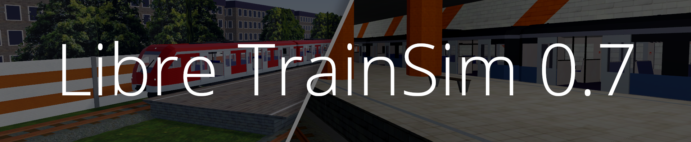

Train Simulator written in Godot Engine - Free for everyone. Licensed under GPL 3.0

## [Play](https://www.libretrainsim.org/download)

## [Contribute](https://github.com/Libre-TrainSim/Libre-TrainSim/wiki/Contribute-to-Libre-TrainSim)

## Project:
This project is created by Jean28518 from germany in his free time, who is studying computer science. The aim is to create a modern fully free Train Simulator for Linux, Mac and Windows.

## Your Feedback wanted:
Did you already play? -> It would be great, if you could answer a survey, which does take about 3 Minutes.

[Click Here](https://www.libretrainsim.org/feedback)

**Thank you!**

## Development Progress:
[Follow the development here](https://github.com/Libre-TrainSim/Libre-TrainSim/projects)

## Links:
- Website: https://www.libretrainsim.org
- Github: https://www.github.com/Libre-TrainSim/Libre-TrainSim
- YouTube: https://www.youtube.com/channel/UCsPsL_AkVUZMmKOKJgm7xsQ
- Itch: https://jean28518.itch.io/libre-train-sim
- Google Play: https://play.google.com/store/apps/details?id=org.godotengine.libretrainsim
- Flathub: https://flathub.org/apps/details/org.libretrainsim.Libre-TrainSim
- Discord: https://discord.gg/AQdAtZZ
