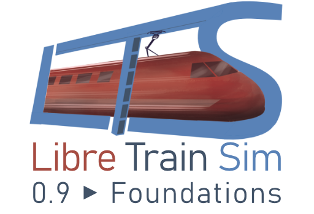

[Libre Train Sim](https://libretrainsim.org) is a free and open source train driving simulator created using the Godot Engine. It is licensed under the [GPL v3 license](LICENSE).

**[Play](https://www.libretrainsim.org/download/)** ► **[Contribute](https://github.com/Libre-TrainSim/Libre-TrainSim/wiki/Contribute-to-Libre-TrainSim)**

---

## About

This project was initially created by Jean28518. As the project attracted new contributers, we moved the repository into the [Libre Train Sim Organisation](https://github.com/Libre-TrainSim/). We want to create a modern, fully free train driving simulator running on Linux, Mac, Windows, and Android.

## Leave Feedback

Nothing is perfect. If you found a bug, please feel encouraged to create a [bug report](https://github.com/Libre-TrainSim/Libre-TrainSim/issues/new/). If you want to give more detailed feedback, you can fill out this [form](https://www.libretrainsim.org/feedback/).

**Thank you! :heart:**

## Development Progress
[Follow the development here](https://github.com/Libre-TrainSim/Libre-TrainSim/projects)

## Links:
- Website: https://www.libretrainsim.org/
- Github: https://www.github.com/Libre-TrainSim/Libre-TrainSim
- YouTube: https://www.youtube.com/channel/UCsPsL_AkVUZMmKOKJgm7xsQ
- Itch: https://jean28518.itch.io/libre-train-sim
- Google Play: https://play.google.com/store/apps/details?id=org.godotengine.libretrainsim
- Flathub: https://flathub.org/apps/details/org.libretrainsim.Libre-TrainSim
- Discord: https://discord.gg/AQdAtZZ
